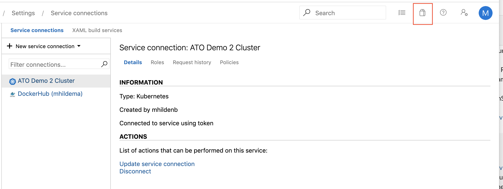
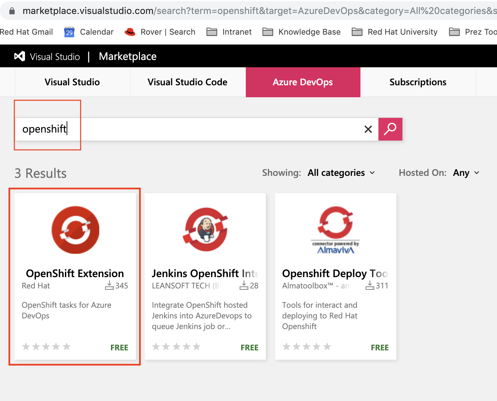
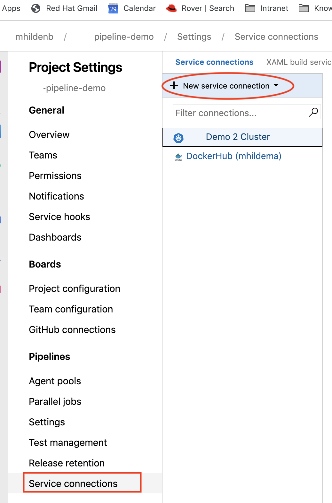
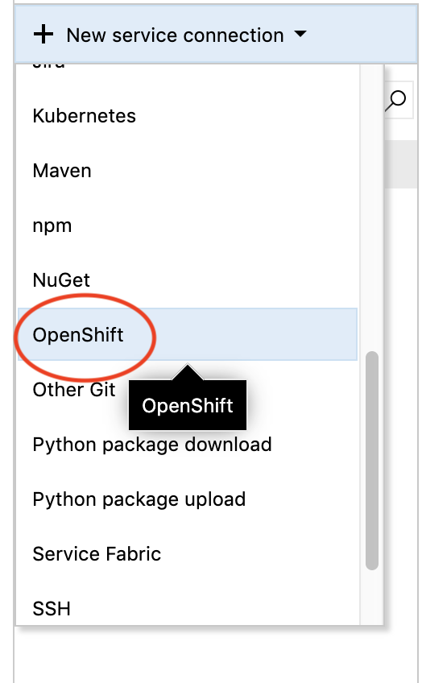

= Integration with Azure DevOps

== Installing OpenShift Extension

First, locate go to the Azure DevOps Marketplace

Search for "OpenShift" and select the "OpenShift Extension"

== Setting up OpenShift Service Connection

Navigate to the Service Connections in the Project Settings

The OpenShift service connector should show up in the list.  Select it

For more information on how to configure the OpenShift service connection, see link:https://github.com/redhat-developer/openshift-vsts/blob/master/docs/getting-started.md[here].

NOTE: You can also use the Kubernetes Service Connection, but this requires setting up an appropriate service account and connecting the proper secret